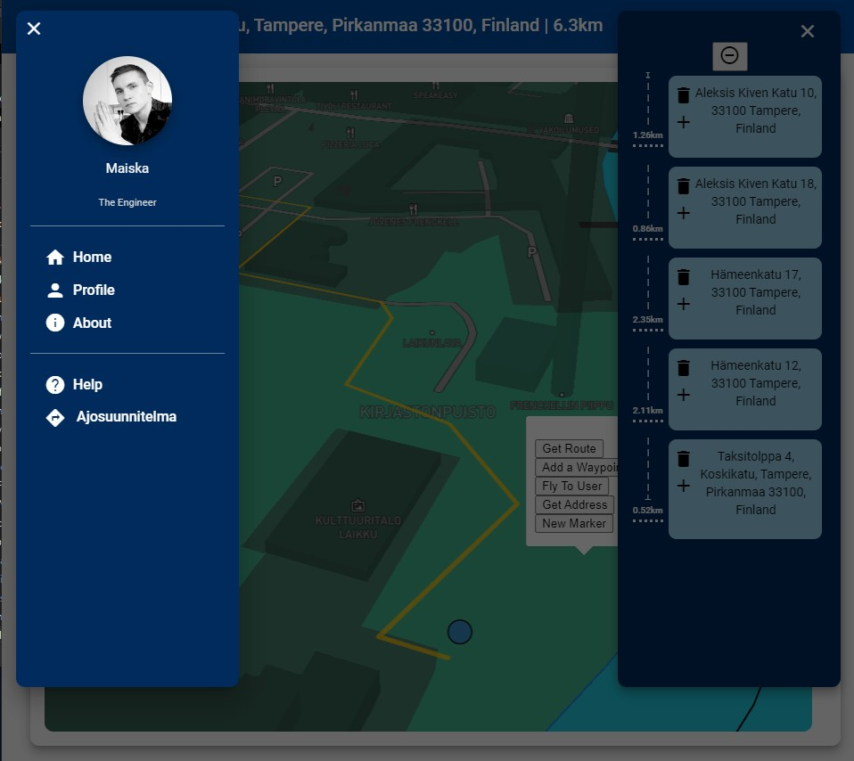
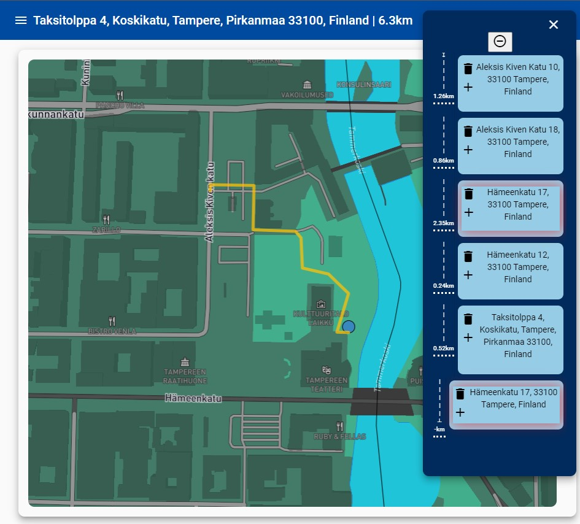

> "Why everything about sole trader -work is so goddman frustating... even driving-logbook is either costly or pain to maintain personally!"

hence why born,

# distance-logger-mapbox

Angular based vehicle driving log application

| Frontend | Map Library | Tested On |
|--|--|--|
|  |  |  |

## Few previews of the app

https://user-images.githubusercontent.com/42906162/199665949-05e5e753-e519-48e6-85a4-f69f9a3b7a4c.mp4

https://user-images.githubusercontent.com/42906162/169656932-cf920491-a3ce-4c87-9e5a-ef4a35b1584e.mp4

